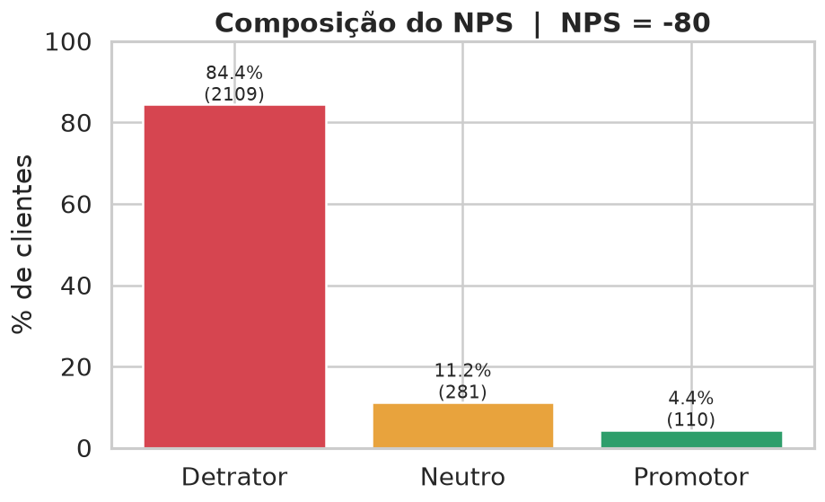
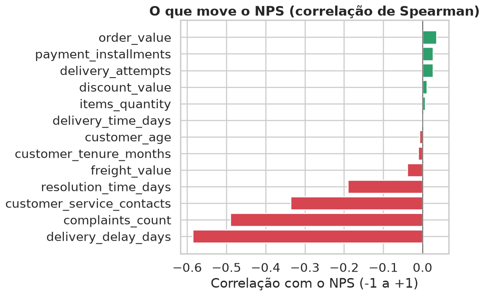
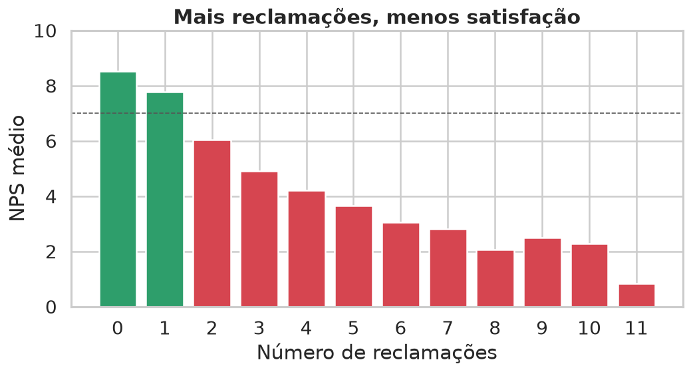
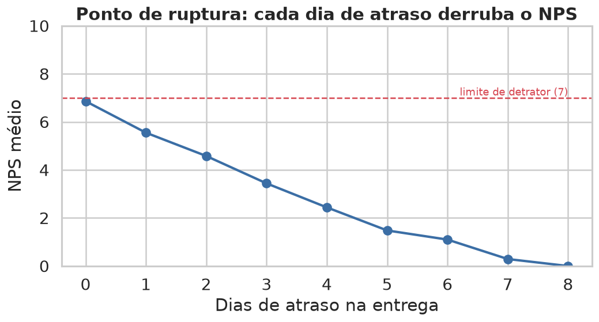
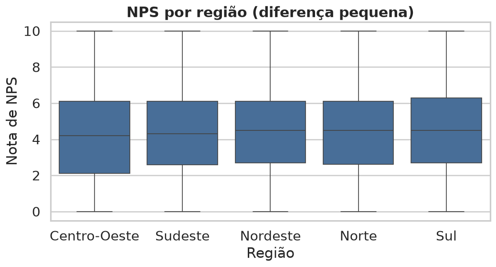

# Etapa 3, Análise Exploratória (EDA) com foco em negócio

## O ponto de partida: temos um problema sério de satisfação

De cada 100 clientes, **84 são detratores**, 11 são neutros e só **4 são promotores**. O NPS
consolidado é **−80**, praticamente o pior cenário possível. Não é "uns clientes insatisfeitos
aqui e ali": a insatisfação é a regra, não a exceção.

A boa notícia: quando olhamos *por que* isso acontece, os dados apontam para **poucas causas,
todas operacionais e dentro do nosso controle**.

---

## 1. Quais fatores são mais críticos para a satisfação?

Medimos o quanto cada informação "anda junto" com a nota de NPS. Quatro fatores se destacam e **todos são de entrega e atendimento**:

| Posição | Fator | O que significa |
|---|---|---|
| 1º | **Atraso na entrega** | Quanto mais a entrega atrasa em relação ao prometido, menor o NPS |
| 2º | **Reclamações** | Cada reclamação registrada puxa a nota para baixo |
| 3º | **Contatos com o atendimento** | Quanto mais o cliente precisa ligar/escrever, pior |
| 4º | **Tempo para resolver o problema** | Demorar para resolver corrói a satisfação |

E o que **não** mexe no NPS: valor do pedido, desconto, frete,
número de parcelas, idade do cliente, tempo de casa e até a **região**. Ou seja: **não dá para
"comprar" satisfação com desconto**, ela se ganha (ou se perde) na operação.

---

## 2. O que mais gera detratores?

**O atraso na entrega, disparado.** É o fator mais forte de todos. Logo atrás vêm as
**reclamações** e os **contatos repetidos com o atendimento**. Repare no padrão: as três coisas
que mais geram detrator são justamente os momentos em que **a operação falhou e o cliente teve
que correr atrás**, esperar além do prazo, reclamar, ligar de novo.

Quem entrega no prazo e não dá motivo para o cliente acionar o suporte simplesmente **não gera
detrator**. O cliente raramente reclama de preço; ele reclama de **não receber o que foi
prometido, no prazo prometido**.

---

## 3. Existe um "ponto de ruptura" na experiência?

**Sim, e é muito nítido: o atraso na entrega.** Veja a queda:

- **Entrega no prazo (0 dia de atraso):** NPS ~6,9, o cliente está quase virando promotor.
- **Cada dia de atraso:** derruba a nota em cerca de **1 ponto**.
- **A partir de ~2 dias de atraso:** a nota já cai abaixo de 7, o cliente **vira detrator**.
- **5 dias ou mais:** NPS perto de zero, cliente perdido.

O detalhe mais importante para a operação: **o tempo total de entrega, sozinho, quase não
importa.** O que destrói a satisfação é **atrasar em relação ao que foi prometido**. Em outras
palavras, um prazo de 10 dias *cumprido* satisfaz mais do que um prazo de 5 dias *estourado*.
**O vilão é a quebra de expectativa, não a velocidade.**

---

## 4. Que tipo de cliente tem NPS mais alto ou mais baixo?

Não é sobre *quem* é o cliente (idade, região, quanto gasta), é sobre *o que aconteceu* com o
pedido dele:

**🟢 Cliente com NPS alto:**
- Recebeu **no prazo** (sem atraso);
- **Não** registrou reclamações;
- **Não** precisou acionar o atendimento.

**🔴 Cliente com NPS baixo (detrator):**
- Sofreu **atraso** na entrega;
- **Reclamou** uma ou mais vezes;
- **Voltou a contatar** o atendimento, muitas vezes esperando resolução demorada.

A geografia confirma a história: o NPS é praticamente igual em todas as regiões (médias entre
4,2 e 4,5). O problema é **transversal e operacional**, não de um mercado específico.

---

## O que isso quer dizer para a operação

1. **A satisfação se decide na entrega.** Atrasou, perdeu o cliente. Cumprir o prazo prometido
   é a alavanca número 1, mais do que encurtar o prazo.
2. **Cada reclamação e cada novo contato é um sinal de alerta.** Resolver rápido e no primeiro
   contato evita o detrator.
3. **Desconto e frete não salvam a experiência.** O dinheiro está melhor investido em
   **entregar o combinado** do que em compensar o cliente depois.
4. **Dá para agir antes da pesquisa:** como as causas são operacionais e conhecidas no momento
   do pedido, conseguimos prever quem vai virar detrator e agir preventivamente.
