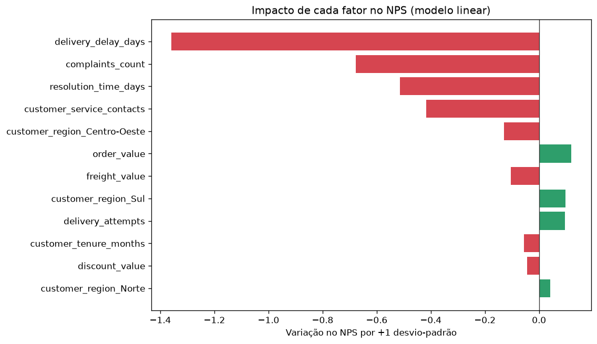
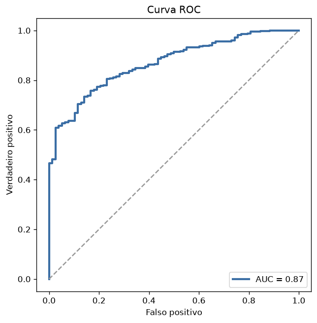
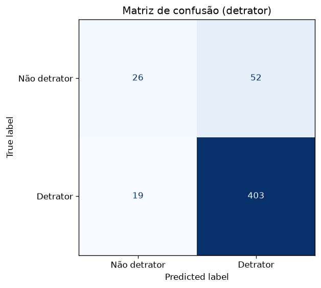

# Etapa 4 — Estratégia de Modelo Preditivo (parte opcional)
## A pergunta que o modelo responde

*Conseguimos antecipar a insatisfação do cliente a partir de dados operacionais, **antes** da aplicação da pesquisa de NPS?*

Se sim, a empresa deixa de só *medir* a dor (NPS retrospectivo) e passa a **preveni-la**.

## Estratégia: regressão **e** classificação (complementares)

Implementei as duas abordagens sugeridas no desafio, porque respondem a perguntas diferentes:

| Abordagem | Alvo | Pergunta de negócio | Quando usar |
|---|---|---|---|
| **Regressão** | `nps_score` (0–10) | "Que **nota** esse cliente tende a dar?" | Acompanhar tendência, simular impacto de melhorias |
| **Classificação** | `is_detractor` (`nps < 7`) | "Esse cliente vai virar **detrator**?" | Acionar lista de risco para ação preventiva |

**Lidero pela classificação** por ser mais acionável: o time de CX não precisa da nota exata,
precisa saber **em quem agir agora**. A regressão entra como leitura complementar e
interpretável dos fatores.

## Definição da variável-alvo
- **Regressão:** `nps_score` contínuo.
- **Classificação:** `is_detractor = 1` se `nps_score < 7` (régua oficial do NPS).

(Detalhes e riscos de vazamento em `02_definicao_target.md`.)

## Seleção e preparação das variáveis de entrada
- **14 features operacionais** disponíveis **antes** da pesquisa: dados do pedido (valor, itens,
  desconto, parcelas), logística (tempo, atraso, frete, tentativas) e atendimento (contatos,
  tempo de resolução, reclamações), além de idade, tempo de casa e região.
- **Excluídas por vazamento (leakage):** `repeat_purchase_30d` e `csat_internal_score` — são
  resultados/sinais de satisfação que não existiriam no momento da predição. Excluí-las derruba
  o R² de ~0,65 para ~0,55, mas esse é o desempenho **honesto** e utilizável na prática.
- **Pré-processamento:** padronização (`StandardScaler`) das numéricas — necessária para o
  modelo linear/logístico — e *one-hot encoding* de `customer_region`. Tudo encapsulado em um
  `Pipeline` do scikit-learn, evitando vazamento entre treino e teste.

## Lógica de separação dos dados
- **Treino/teste 80/20**; na classificação a divisão é **estratificada** (preserva a proporção
  de detratores, dado o forte desbalanceamento).
- **Validação cruzada de 5 folds** no treino para estimar desempenho com menos sorte/azar de
  divisão e escolher o modelo final pela métrica média.

## Escolha do modelo: simples antes de complexo
Seguindo o CRISP-DM, comecei por um **baseline interpretável** (Regressão Linear / Logística) e
comparei com **Random Forest**. Resultado:

**Regressão (estimar a nota):**

| Modelo | RMSE | MAE | R² | CV R² |
|---|---|---|---|---|
| **Regressão Linear** ✅ | **1,69** | **1,33** | **0,55** | **0,554** |
| Random Forest | 1,74 | 1,39 | 0,52 | 0,526 |

**Classificação (risco de detrator):**

| Modelo | Precisão | Recall | F1 | AUC | CV AUC |
|---|---|---|---|---|---|
| **Regressão Logística** ✅ | 0,89 | 0,96 | 0,92 | 0,87 | **0,896** |
| Random Forest | 0,88 | 0,98 | 0,93 | 0,87 | 0,874 |

**O modelo simples empatou/superou o complexo** — então fiquei com o **modelo interpretável**.
Os relacionamentos são essencialmente monotônicos, e o Random Forest ainda *inflava* a
importância de variáveis-ruído de alta cardinalidade (ex.: `order_value`), o que reforça a
escolha pelo linear.

## Quais fatores o modelo usa
Os coeficientes padronizados do modelo linear **confirmam exatamente a EDA** — o que dá
confiança de que o modelo aprendeu o fenômeno certo, não ruído:

`delivery_delay_days` (−1,36) ≫ `complaints_count` (−0,68) > `resolution_time_days` (−0,51) >
`customer_service_contacts` (−0,42). O resto ≈ 0.

## Forma de avaliação dos resultados
- **Regressão:** RMSE/MAE em **pontos de NPS** (erro médio ~1,3–1,7 ponto numa escala 0–10) e
  R² (~0,55 da variação explicada só com dados operacionais).
- **Classificação:** priorizo **AUC** (~0,87 → boa capacidade de *ordenar* clientes por risco),
  recall e precisão. **Acurácia foi descartada como métrica-chave**: com 84% de detratores ela
  engana (Cap. 3). Avalio também a **matriz de confusão** e discuto o **limiar (threshold)** —
  ajustável conforme a capacidade de ação do time (mais recall = pega mais detratores, ao custo
  de mais falsos alertas).

 

## Como a empresa usaria isto na prática
1. **Score de risco por pedido.** O classificador devolve a *probabilidade de detrator* de cada
   pedido em aberto, em tempo real.
2. **Fila proativa de CX/logística.** Pedidos com alto risco (ex.: atraso se acumulando +
   reclamação aberta) entram numa lista de ação **antes** da pesquisa: alerta de atraso,
   contato proativo, priorização de entrega, compensação.
3. **Simulação de melhorias.** Com a regressão, dá para estimar "quanto de NPS ganhamos se
   reduzirmos atrasos em 1 dia" — apoiando decisão de investimento.
4. **Monitoramento (MLOps).** Acompanhar lado a lado a métrica técnica (AUC) e a de negócio (NPS
   real), retreinar periodicamente e validar ações com **teste A/B** antes de escalar.

## Limitações e riscos
- Base **sintética/histórica**: validar com dados reais e PoC antes de produção.
- **Desbalanceamento** (84% detratores): foco no score/ranqueamento, não no rótulo cru.
- **Correlação ≠ causalidade**: o modelo prioriza onde olhar; A/B confirma o que de fato muda o
  NPS.
- O modelo só enxerga o que está nos dados internos — fatores externos (transportadora, clima,
  sazonalidade) não estão capturados.
